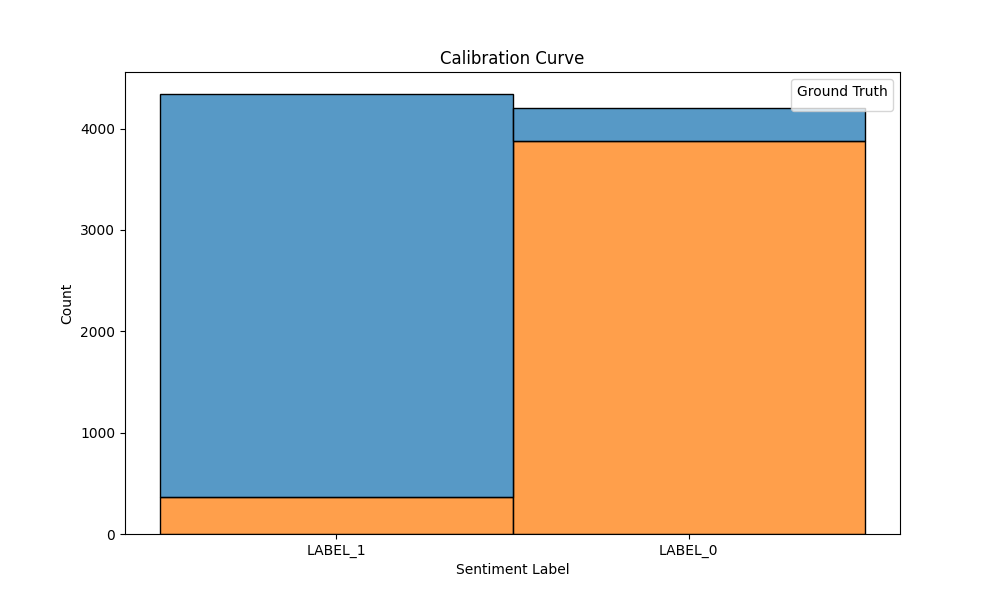

# Welcome to the official repo for Supervised Learning Preference Optimization

I developed the thinking of SLPO after looking into DPO and it's amazing
reformulation of RLHF into a Maximum Likelihood Estimation problem. But
I didn't like the use of RL concepts like a reward, or the Bradley-Terry
model, so I sought to further reduce the problem into an even more
familiar construct of Crossentropy loss of a softmax activated model. There
was a limit to how far I could take this, so I made some adjustments
to derive a pure CCE based loss. 

The paper will be put on TechRxiv shortly and then submitted to a 
conference or journal. The implementation is vectorized within sequences,
but when packing sequences into a full context window, and batching,
those are not yet vectorized.

This code is GPL, which was chosen because it is infecting. The code and
paper are copyright 2025 Yaoshiang Ho. Contact me for commercial
uses or for other licenses.

## Installation

pip install -e .

## Organization

The `paper/` directory includes the raw latex, viz.ipynb for visualizations,
and the PDF.

The `src/slpo` directory contains the slpo function itself, as well
as some data handling utilities. 

The `test` directory contains multiple unit and ML tests. Run pytest. Goal
of this repo is zero warnings and zero errors. 

The `src/experiments` directory contains code to repro experiments.

## SLPO

Like most RLHF and RLHF-inspired algorithms, the inputs are:

* x: This is the prompt.
* y_w: This is the chosen (or winning) completion.
* y_l: This is the rejected (or losing) completion.

Like DPO, SLPO also requires values from a reference model, namely,
* prob(y_w | x): Probability of the chosen/winning completion. This is 
  typically a very small number, so we store it as a logprob.
* prob(y_l | x): Probability of the rejected/losing completion. This is 
  also stored as a logprob.

## Data prep

The current implementation only handled padded sequences. Packing is not supported.

## Experiments


`experiment/sentiment/` Reproduces the DPO paper's GPT2, IMDB controlled
sentiment analysis. 

```
In controlled
sentiment generation, x is a prefix of a movie review from the IMDb dataset [24], and the policy
must generate y with positive sentiment. In order to perform a controlled evaluation, for this
experiment we generate preference pairs over generations using a pre-trained sentiment classifier,
where p(positive |x,yw) >p(positive |x,yl). For SFT, we fine-tune GPT-2-large until convergence
on reviews from the train split of the IMDB dataset (further details in App C.1). 
...
 in the
controlled sentiment generation setting we evaluate each algorithm by its frontier of achieved reward
and KL-divergence from the reference policy; this frontier is computable because we have acccess to
the ground-truth reward function (a sentiment classifier). 
...
C.1 IMDb Sentiment Experiment and Baseline Details
The prompts are prefixes from the IMDB dataset of length 2-8 tokens. 

We use the pre-trained senti-
ment classifier siebert/sentiment-roberta-large-english as a ground-truth reward model
and gpt2-large as a base model. We use these larger models as we found the default ones to
generate low-quality text and rewards to be somewhat inaccurate. 

We first use supervised fine-tuning on a subset of the IMDB data for 1 epoch. 

We then use this model to sample 4 completions for 25000
prefixes and create 6 preference pairs for each prefix using the ground-truth reward model. 
```


`experiment/_sentiment-phi2-textattack/` Deprecated. Initially intended to
perform controlled sentiment analysis,
the same task in the original DPO paper. Instead of their approach, we 
use an existing sentiment dataset, Stanford Sentiment Treebank 2 (SST-2), and
use a sentiment classifier created for it, namely, `textattack/roberta-base-SST-2`
which we demonstrate achieves 92% accuracy. 

To reproduce, run:

```sh
$ cd src
$ python -m experiment.sentiment.eval
$ python -m experiment.sentiment.analyze

Accuracy: 0.92
```

It also generates a bar chart confusion matrix. . 
